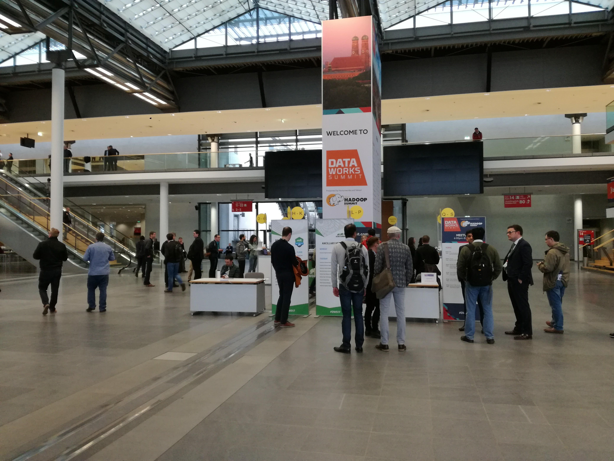
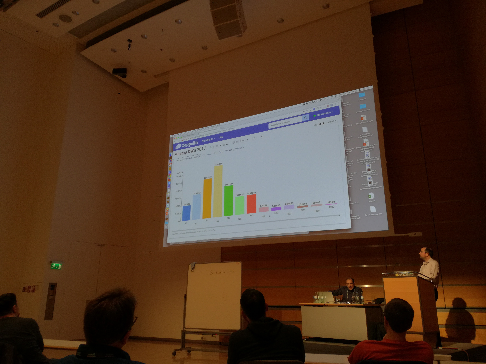
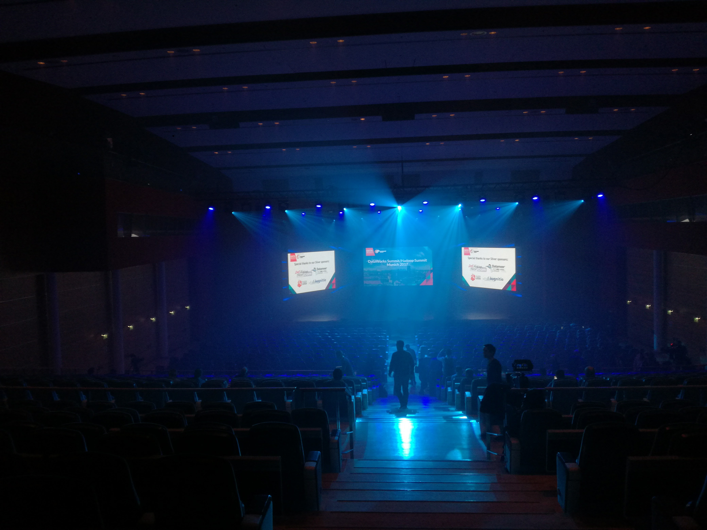
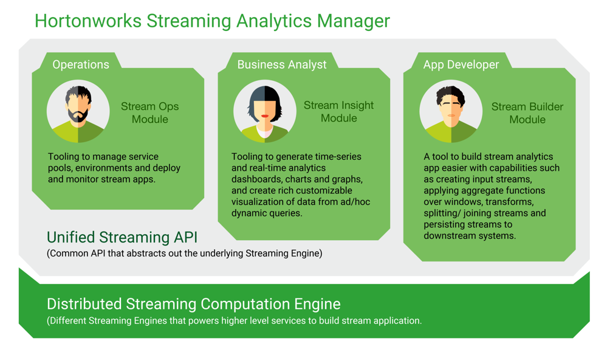

April 4th, 5th and 6th 2017, Munich, Germany was good place to be. DataWorks Summit (or as previously called Hadoop Summit) is a conference organized by Hortonworks and Yahoo. It is about Hadoop, Big Data and Open Source community.

This year I've had a chance to be there for the first time and figured I will share my thoughts about the event and things around it.

I have arrived on Tuesday, 4th April, one day before the conference starts but there were some unoficial events that day too. You could have taken one of the trainings or came to several meetups organized by speakers of the event.

Anyway, for all of you traveling to Munich for the first time. If you happen to get out of your plane and instead of walking into baggage claiming area you are entering the shopping and restaurant zone, don't be worried, that's how it is there ... Your bagge is there somewhere, it's just that somewhere happens to be at the other end of the airport. You have to take a train to get it. I may have not visited a lot of big airports in my life yet, but I have seen few and this was first time I've seen it :) But it could be true (and most probably is) only for the terminal I used, so your expeirence may vary.

  

But let's focus on the main topic. Tuesday was meetups day as I mentioned. There were few of them:

- Accelerating Apache Big Data and Machine Learning Workloads on OpenPOWER
- Big Data in Automotive
- Tensorflow and Hadoop, Accelerating HBase & Using BigBench to compare Hive and Spark
- Cloud – Running and Securing Hadoop in the Cloud
- **SAS and Spark on HDP**
- Solving Cybercrime at Scale and in Realtime

I went to the SAS and Spark on HDP which happend to be Spark on HDP as the SAS speaker couldn't make it. Meetup was hosted by Bernhard Walter and Aengus Rooney of Hortonworks. We went through history and how all that data science in a distributed way started. For all of you not that much into hadoop and Spark in particular. The whole fuss about it is not because spark has some extra powerfull algorithms that are not seen in different libraries, it's because Spark works in a distributed way. That means you are not limited to your PC or Server computing power or amount of RAM you have there.

In fact while Spark is definitelly good at selection of Machine Learning algorithms (MLib), there are betters. But for large scale computations where your training set is large, having possibility to train the model on a cluster of machines is what made it so popular. Of course Spark is not only about ML, but the reasoning still holds. If you have large dataset it is better to compute it having more RAM and CPU at your disposal.

Anyway, Bernhard and Aengus went through the example of building recommendation model based on last.fm dataset that was released sometime in 2015 with arround 1.8 million of artits. Really interresting panel with quick introduction how you can build that in Spark and what are best practices in setting hyperparamethers for instance. How should we use existing data for training and cross validation.

BTW, did you know most people listen to 160 artists only?

I mentioned where Spark wins and why, but if the dataset is small, then often it is better to switch to something else like numpy. Like when guys showed how they checked how many false hits their model produces. We know the exact list of artists each user listens to, we have created a model that predicts what would they like to listen to. We can check the model by running it on a subset of users and look for recommendations of artists they never listen to. Dataset for that one had only 1500 rows, and it was easier to run it locally using numpy.

We haven't discussed what next if truth be told, I mean once you have your perfect model what are best scenarios to deploy them in production. We may want to have dedicated post about it sometime in future though.

OK. So that was first day. The summit official start date was Wednesday though at 8AM with breakfast.

At 9AM it really kicked off with a Keynote and pretty amazing laser show :). This kind of fireworks are common for EMC from my experience, apparently Hortonworks is into it a little too ;) Well, there were no dancers so EMC wins there. But most important was the content of course.

As one can expect, keynote is for highlevel panels, it's also time for sponsors so nothing very exiting, but one speaker got my full attention and I must say I really liked his panel. It seems that organizers wanted to make sure not everything panels are technical / business. They invited few speakers who focus on ethical side of Data Driven society. The particular panel was held by Dr Barry Devlin. 

In times when AI gets so much better ar interacting, reading context and running processes, we should expect more and more problems due to the fact manual labour but also high profile labour will no longer be needed. Dr Devlin says new approach to handling this kind of issues is needed and guaranted income for everyone is one of them. If you have a chance to watch his speach - definitelly do.

During keynote a panel with experts took place too. Most interresting thing I remember from it is what Daljit Rehal of Centrica said about how the work culture changed in his company. Data driven projects are very demanding in terms of skilled engineers. At Centrica some cultural changes had to take place so that employees can focus on actuall work instead of figuring out how they should do that work. Motivation for self development is also a key factor. So the approach changed from centrally managed environment to more people centric approach. For instance if you work at Centrica and already has preffered language you code in, if only it can be used - you are free to do it. I am aware this is not always possible but in project so much oriented on Open Source solutions, this is very much possible and most probably the only way to go. As for motivating people for self development. Engineers at centrica are encourages to give lectures at local Universities which gives them strong motivation factor to be prepared I suppose ;)

Technical and business sessions were held in 6 different rooms simultaneously. This was the toughest part of the summit, how on earth are you suppose to choose if most of them are equally interesting?

Good thing about DWS is that most if not all session will be available on YouTube, so you can catch up with those you missed. I strongly encourage you to do so.

I will sunmmarize some of the sessions I have watched and think were most interesting ones. I think some of them will lead to separate posts related to what was shown on that sessions. So stay tuned for more!

And go and check DataWorks Summit videos that will be posted on Youtube. I will edit the post when they are published and add links to some I will describe below.

---

**INTERACTIVE ANALYTICS AT SCALE IN APACHE HIVE USING DRUID**

If you need to create and then publish dashboards that are built on large amount fo data, then Druid is something you may want to check on. One use case would be for data that you prepare in Spark and then publish in Druid. The advantage of Druid compared to SparkSQL is latency. Druid indexes all its data. So if you need to create visualization layer in your company with large amount of people using it, have a look.

For more information and a benchmark that compares Druid to Spark, have a look at <a href="https://www.linkedin.com/pulse/combining-druid-spark-interactive-flexible-analytics-scale-butani">this</a> post of Harish Butani.

---

**Streaming Analytics Manager**

This is something that I'd like to play around definitelly. You should expect dedicated article some time on the future.

SAM - among others - is a graphical tool that lets you build whole streaming process without need to write a code. Most importantly if at any moment in time schema changes at any place in your process, adjusting it is honestly really easy. Normally you'd have to change code, here you have everything accessible from nice GUI.

<b>Source: [https://hortonworks.com/info/streaming-analytics-manager/](https://hortonworks.com/info/streaming-analytics-manager/)</b>

On top of that, you have access to all your streaming data and even some metrics in one single graphical tool. If you are into streaming, watch the session recording as soon as it is up on Youtube (I'll add the link then).

This is not yet production ready mind you.

---

**Machine Learning in Healthcare**

Some of the session were not about particular tools, new releases, new functionalities. They were about real life examples how Big Data Technologies helped or allowed for businesses to grow or helped scientists or doctors be more precise and much faster in their work.

One of that session was held by Wade Schulz, Physician Scientist and Clinical Pathology Resident at Yale School of Medicine. Wade is also lead architect of Big Data platform at mentioned School that also operates one of the largest hospitals in US, Yale-New Haven Hospital.

He gave an example of how they learned to use that possibilities of new technologies. One of the most often laboratory test made in hospitals around the world is [peripheral blood smear](http://www.healthline.com/health/blood-smear#overview1). Blood sample is put on a glass and checked using microscope. Depending on anomalies found a diagnose could be made. Normally tests are subject to human eye perceptivity and its owner experience. In a hospital such as this there are hundreds of those tests made daily. Due to its nature it requires a lot of personel and time to be involved.

Dr Schulz and his team work on a Machine Learning model that will analyse images of monolayer containing the tests data. It is now during acceptance tests of sort but already is much more accurate and much faster than current way of doing the tests. Eventually approval by a physician may still be needed to accept the result of an algorithm, but even then the gains could be significant. Mostly in terms of time needed for tests results and that can lead to more lifes saved.

Each new technologies can be used for bad or good thing. This definitelly is an example of the later.

I wonder if similar research is done at any European hospitals or Laboratory centers. If you know about any, please let us know!

---

I have seen more sessions, plan to watch even more once they are available on Youtube. And you will see dedicated posts about some of the concepts and tools which are not described in this article.

A good summary for this year DataWorks Summit may be the fact that a lot of use cases, real life examples and development seem to go toward streaming and IoT technologies. Batch processing will be taken over by streaming quite soon Laregely due to IoT and there, automotive seem to be the main actor.

BMW and their Big Data Team lead held a session about they're journey, where they are and what still needs to be done. Especially given the fact they are part of big international organization where processes makes some things happen slower than at a startup for instance. Anyway, the message was clear. BMW sells almost 2 millions cars each year. Each of them is now "connected". This is huge amount of data to tranfer, store and anlyze. Cars soon will not only send data to central, they will communicate with each other and with the surroundings. Their sensor will (and some already are) use advanced AI algorithms to drive the cars by themselves. This all will be possible thanks to development in Big Data technologies.

Tobias Buerger who gave that speach shared also experience he and his team had and what are their lessons learned. I can only recommend to watch his pannel so much to every team leads, managers and CTOs who have something to do with new technologies, Big Data in particular. Some of the most important experience they have (that's something so obvious it's hard to imagine someone would not know it, and yet...) were:

- Make sure you have a great team! From my own experience too, yes, this is important, so much, really.
- Be prepared for immaturity. In so dynamic environment as anything related to Big Data - yes. Don't expect enterpise grade, production ready everything. Sometimes you may need to choose between environment tested for years that will need a month to analyze your data and environment which may not have that much maturity, but will perform the analysis in 5 minutes. The choice is yours.
- Be prepated for pitfalls, it happens.
